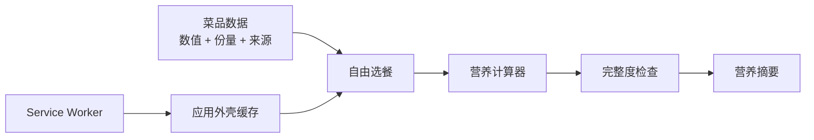

# 架构说明

## 目标

项目使用无运行时依赖的静态 Web 架构，优先验证三个核心问题：

1. 不同份量口径能否正确计算；
2. 缺失营养值能否安全传播；
3. 应用能否在首次访问后离线运行。

## 数据流

## 模块

- `src/data/foods.js`：应用数据与来源元信息。
- `src/core/nutrition.js`：数量校验、营养合计、缺失值传播、食盐当量和说明文本。
- `src/app.js`：浏览器状态、渲染、交互和 Service Worker 注册。
- `service-worker.js`：预缓存应用外壳、清理旧缓存、在线更新和离线回退。
- `scripts/dev-server.mjs`：仅用于本地开发的静态服务器。
- `scripts/build.mjs`：生成 GitHub Pages 使用的 `dist/`。

## 关键设计决定

### 不引入后端

当前只有 20 条静态数据，不涉及账号、私密信息或服务端任务。数据规模、用户导入或定期同步出现后，再考虑后端。

### 不把缺失值当成零

只要所选菜品中任一项缺失某个指标，该指标总计就是 `null`。页面可以展示已知部分，但不会把它冒充完整合计。

### 缓存应用，不缓存外部来源

Service Worker 只处理同源 GET 请求。页面导航采用网络优先、离线回退到 `index.html`；脚本、样式和数据采用缓存优先并在后台更新。外部数据来源链接保持联网访问，不复制第三方内容。
