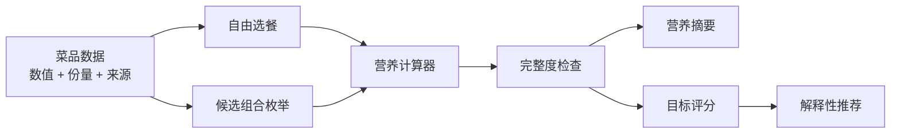

# 架构说明

## 目标

V1 使用无运行时依赖的静态 Web 架构，优先验证三个核心问题：

1. 不同份量口径能否正确计算；
2. 缺失营养值能否安全传播；
3. 推荐结果能否解释和复现。

## 数据流

## 模块

- `src/data/foods.js`：V1 的应用数据与来源元信息。
- `src/core/nutrition.js`：数量校验、营养合计、缺失值传播、食盐当量和说明文本。
- `src/core/recommendation.js`：候选枚举、目标评分与排序。
- `src/app.js`：浏览器状态、渲染和交互。
- `scripts/dev-server.mjs`：仅用于本地开发的静态服务器。
- `scripts/build.mjs`：生成 GitHub Pages 使用的 `dist/`。

## 关键设计决定

### 不引入后端

V1 只有 6 条静态演示数据，不涉及账号、私密信息或服务端任务。此时增加数据库和 API 只会扩大维护面。数据规模、用户导入或定期同步出现后，再引入后端。

### 不把缺失值当成零

只要所选菜品中任一项缺失某个指标，该指标总计就是 `null`。页面可以展示已知部分，但不会把它冒充完整合计。

### 枚举而不是随机抽取

当前候选空间很小，完整枚举可以保证：

- 不漏掉更优组合；
- 相同输入得到相同输出；
- 测试结果稳定；
- 每个排名都有明确依据。

### 数据质量与营养表现分开

“营养得分”不能掩盖数据缺口。控钠模式需要钠数据完整，否则整个模式不可用。
